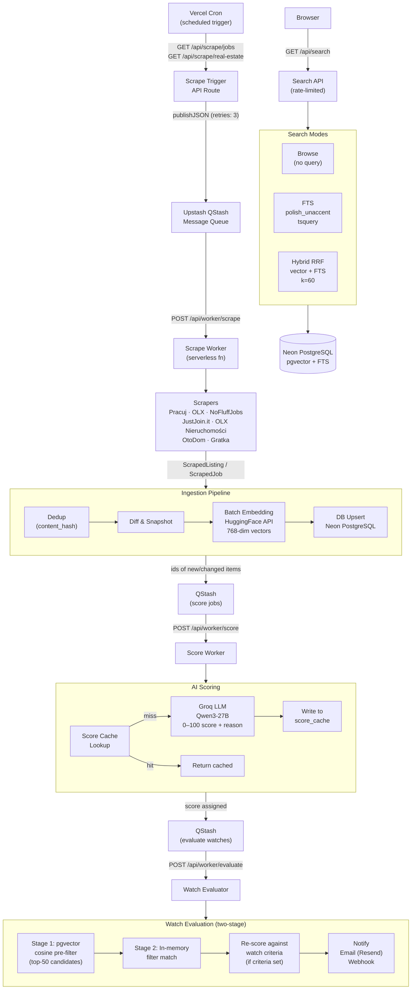
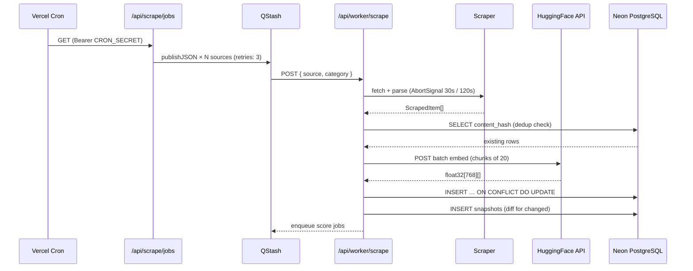
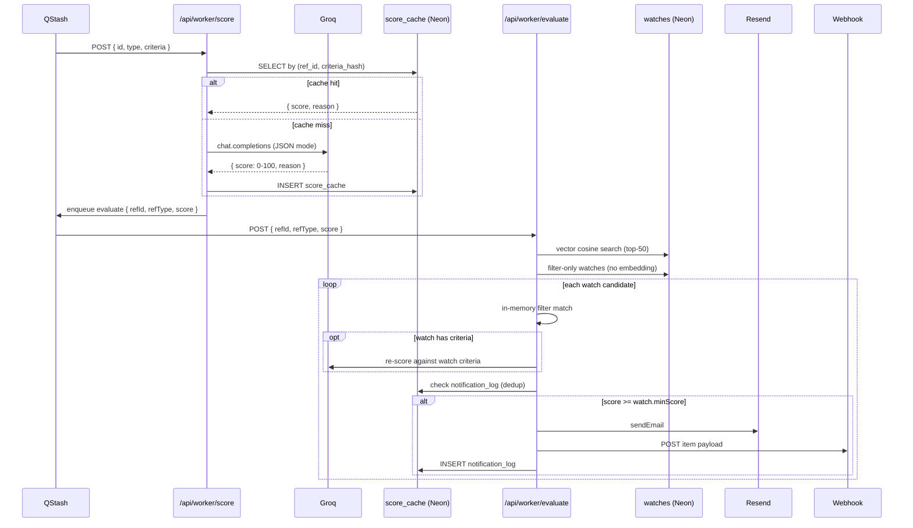
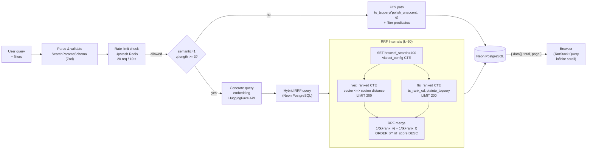
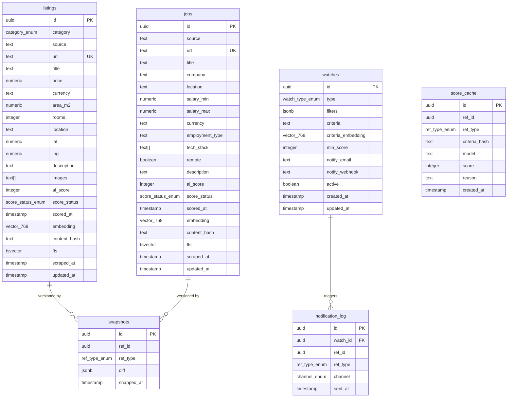

# offer-web-scrapper

> Intelligent job & real-estate aggregator with AI scoring, hybrid semantic search, and automated watch alerts — deployed serverlessly on Vercel.


---

## Overview

**offer-web-scrapper** continuously harvests job offers from Pracuj.pl, OLX Praca, NoFluffJobs, and JustJoin.it — alongside real-estate listings — and feeds them through a fully async AI pipeline that:

1. Deduplicates and diffs incoming items using SHA-256 content hashes
2. Generates multilingual dense embeddings (768 dims) via HuggingFace
3. Scores each item 0–100 against user-defined criteria using a Groq LLM
4. Indexes everything for hybrid full-text + vector search with Reciprocal Rank Fusion
5. Evaluates active user "watches" and dispatches email / webhook notifications

---

## Architecture



---

## Tech Stack

| Layer | Technology | Notes |
|---|---|---|
| **Framework** | Next.js 16 (App Router) | React 19, TypeScript strict |
| **UI** | Tailwind CSS 4, shadcn/ui, Base UI | Dark/light theme via `next-themes` |
| **Animations** | Framer Motion | Shimmer skeletons, page transitions |
| **Data fetching** | TanStack Query v5 | Infinite scroll, background refetch |
| **Virtualization** | TanStack Virtual v3 | Windowed lists for large result sets |
| **Maps** | react-leaflet + Leaflet | Real-estate pin map |
| **Database** | Neon PostgreSQL (serverless HTTP) | pgvector 768-dim HNSW index |
| **ORM** | Drizzle ORM 0.45 + drizzle-kit 0.31 | Type-safe queries, migrations |
| **Queue** | Upstash QStash | Durable async jobs, built-in retries |
| **Cache / Rate limits** | Upstash Redis + `@upstash/ratelimit` | Sliding window per-IP |
| **Embeddings** | HuggingFace Inference API | `paraphrase-multilingual-mpnet-base-v2` |
| **LLM scoring** | Groq (`Qwen3-27B`) | JSON-mode, seeded, `/no_think` prefix |
| **Email** | Resend | Transactional notification emails |
| **Scraping** | Cheerio + Puppeteer Core | HTML parse + headless JS rendering |
| **Validation** | Zod | Schemas for all API boundaries |
| **Testing** | Vitest + Testing Library | Component + hook unit tests |
| **Deployment** | Vercel | Edge-compatible serverless functions |

---

## Data Flow — Scraping Pipeline



---

## Data Flow — AI Scoring & Watch Alerts



---

## Data Flow — Hybrid Search



---

## Database Schema



---

## API Reference

### Search & Browse

| Method | Path | Description |
|---|---|---|
| `GET` | `/api/search` | Hybrid / FTS / browse for listings and jobs |
| `GET` | `/api/listings/[id]` | Single listing detail |
| `GET` | `/api/jobs/[id]` | Single job detail |
| `GET` | `/api/snapshots` | Change history for a ref |

**`GET /api/search` query parameters**

| Param | Type | Description |
|---|---|---|
| `type` | `listing` \| `job` | Resource type (required) |
| `q` | string | Free-text query |
| `semantic` | `0` \| `1` | Enable hybrid RRF (requires `q`) |
| `category` | `sale` \| `rent_long` \| `rent_short` | Listings only |
| `priceMin/Max` | number | Price range filter |
| `areaMin/Max` | number | Area m2 range filter |
| `rooms` | CSV numbers | Rooms filter |
| `location` | string | Location substring filter |
| `source` | CSV strings | Source filter |
| `salaryMin/Max` | number | Jobs only — salary range |
| `employmentType` | CSV strings | Jobs only — contract type |
| `techStack` | CSV strings | Jobs only — required tech |
| `remote` | `true` \| `false` | Jobs only — remote flag |
| `scoreMin` | 0–100 | Minimum AI score |
| `page` | number | Page number (default: 1) |
| `pageSize` | number | Page size (default: 20) |

### Watches (Alerts)

| Method | Path | Description |
|---|---|---|
| `GET` | `/api/watches` | List all watches |
| `POST` | `/api/watches` | Create a watch |
| `GET` | `/api/watches/[id]` | Get watch by ID |
| `PUT` | `/api/watches/[id]` | Update watch |
| `DELETE` | `/api/watches/[id]` | Delete watch |

### Workers (internal — QStash signed)

| Method | Path | Description |
|---|---|---|
| `POST` | `/api/worker/scrape` | Execute one scrape task |
| `POST` | `/api/worker/score` | Score pending items |
| `POST` | `/api/worker/evaluate` | Evaluate watches after scoring |

### Cron Triggers (Bearer `CRON_SECRET`)

| Method | Path | Description |
|---|---|---|
| `GET` | `/api/scrape/jobs` | Enqueue all job scrape tasks |
| `GET` | `/api/scrape/real-estate` | Enqueue all real-estate scrape tasks |

---

## Rate Limits

| Endpoint | Limit | Window |
|---|---|---|
| `GET /api/search` | 20 requests | 10 seconds (sliding, per IP) |
| `POST /api/score` | 5 requests | 60 seconds |
| `GET /api/watches` | 10 requests | 60 seconds |

Implemented with `@upstash/ratelimit` sliding window algorithm backed by Upstash Redis.

---

## Environment Variables

```bash
# Database
DATABASE_URL=                     # Neon PostgreSQL connection string

# AI / Embeddings
HUGGINGFACE_API_KEY=              # HuggingFace Inference API key
SCORING_MODEL=                    # Groq model override (default: llama-3.1-8b-instant)
GROQ_API_KEY=                     # Groq API key

# Queue
QSTASH_TOKEN=                     # Upstash QStash publish token
QSTASH_CURRENT_SIGNING_KEY=       # QStash signature verification
QSTASH_NEXT_SIGNING_KEY=          # QStash signature rotation

# Cache / Rate limiting
UPSTASH_REDIS_REST_URL=           # Upstash Redis endpoint
UPSTASH_REDIS_REST_TOKEN=         # Upstash Redis token

# Email
RESEND_API_KEY=                   # Resend API key
RESEND_FROM_EMAIL=                # Sender address (e.g. noreply@yourdomain.com)

# App
NEXT_PUBLIC_APP_URL=              # Full public URL (e.g. https://your-app.vercel.app)
CRON_SECRET=                      # Secret for Vercel Cron → scrape trigger auth
```

---

## Getting Started

### Prerequisites

- Node.js 22+
- A [Neon](https://neon.tech) PostgreSQL database with pgvector enabled
- [Upstash](https://upstash.com) Redis + QStash instances
- [HuggingFace](https://huggingface.co) account (free tier)
- [Groq](https://console.groq.com) API key (free tier)
- [Resend](https://resend.com) account for email notifications

### Installation

```bash
# Clone the repository
git clone https://github.com/bwolak94/offer-web-scrapper
cd offer-web-scrapper

# Install dependencies
npm install

# Copy and fill in environment variables
cp .env.example .env.local
```

### Database Setup

```bash
# Generate migrations from schema
npx drizzle-kit generate

# Apply migrations to Neon
npx drizzle-kit migrate

# Enable pgvector + Polish FTS (run once on Neon)
# See drizzle/0007_add_fts_columns.sql for the GENERATED ALWAYS tsvector columns
```

### Development

```bash
# Start local dev server
npm run dev

# Type check
npm run typecheck

# Lint
npm run lint

# Run tests
npm run test

# Run tests once (CI)
npm run test:run
```

---

## Project Structure

```
src/
├── ai/
│   ├── client.ts          # AI model registry (Groq + HuggingFace config)
│   ├── embeddings.ts      # HuggingFace batch embedding with cold-start retry
│   └── scorer.ts          # Groq LLM scoring with SHA-256 cache keying
├── app/
│   ├── api/
│   │   ├── scrape/        # Cron-triggered scrape enqueue routes
│   │   ├── worker/        # QStash worker routes (scrape, score, evaluate)
│   │   ├── search/        # Hybrid search API
│   │   ├── watches/       # Watch CRUD API
│   │   ├── listings/      # Listing detail API
│   │   ├── jobs/          # Job detail API
│   │   ├── score/         # Manual score API
│   │   └── snapshots/     # Change history API
│   └── (dashboard)/
│       ├── real-estate/   # Real-estate browse pages
│       └── jobs/          # Job board page
├── components/
│   ├── filters/           # Filter bar components (price, area, salary, tech stack…)
│   ├── listings/          # Listing card + virtualized list
│   ├── jobs/              # Job card + virtualized list
│   └── ui/                # shadcn/ui primitives + custom atoms
├── db/
│   ├── schema.ts          # Drizzle schema (all tables + enums + relations)
│   ├── index.ts           # Neon HTTP driver + Drizzle instance
│   ├── transformers.ts    # DB row → domain type mappers
│   └── queries/           # Type-safe query functions per table
├── hooks/
│   ├── useFilters.ts      # URL-synced listing filter state
│   └── useJobFilters.ts   # URL-synced job filter state
├── lib/
│   ├── env.ts             # Startup env validation (throws on missing vars)
│   ├── schemas.ts         # Zod schemas for API input validation
│   ├── auth.ts            # Cron secret verification (timing-safe)
│   └── ssrf.ts            # SSRF protection for webhook URLs
├── notify/
│   ├── index.ts           # Notification dispatcher + dedup guard
│   ├── email.ts           # Resend email templates
│   └── webhook.ts         # Webhook POST with SSRF guard
├── pipeline/
│   ├── index.ts           # Listing + job ingestion pipeline orchestrator
│   ├── dedup.ts           # Content-hash deduplication
│   ├── diff.ts            # Field diff computation + snapshot persistence
│   └── watch-evaluator.ts # Two-stage watch evaluation + notification trigger
└── types/                 # Shared TypeScript domain types
```

---

## Key Design Decisions

**Stateless vector search on Neon HTTP driver**
Neon's serverless HTTP driver does not maintain session state between requests. `hnsw.ef_search` is injected via a `SET LOCAL` CTE at the top of every hybrid query rather than a session-level `SET`.

**SHA-256 score cache**
LLM calls are expensive. Every `(ref_id, ref_type, criteria_hash)` triple is cached in `score_cache`. The hash is computed over normalized (lowercased, whitespace-collapsed) criteria text so cosmetically different strings reuse the same cached score.

**Notification deduplication**
QStash guarantees at-least-once delivery. `notification_log` has a unique constraint on `(watch_id, ref_id, ref_type, channel)` so duplicate QStash retries silently no-op instead of sending duplicate emails.

**Hybrid RRF**
Reciprocal Rank Fusion with k=60 fuses vector and FTS result lists without needing score normalization. Each branch is limited to 200 candidates before fusion to keep query latency predictable.

**Content-hash dedup**
Scraped items carry a SHA-256 hash of their mutable fields. The pipeline compares incoming hashes against stored rows before generating embeddings or calling the LLM, skipping unchanged items entirely.

---

## Deployment

The app is deployed on **Vercel**. Cron schedules are defined in `vercel.json`.

```json
{
  "crons": [
    { "path": "/api/scrape/jobs",        "schedule": "0 */6 * * *" },
    { "path": "/api/scrape/real-estate", "schedule": "0 */6 * * *" }
  ]
}
```

All environment variables listed above must be set in the Vercel project settings before deployment. QStash workers are protected by Upstash signature verification (`verifySignatureAppRouter`). Cron triggers are protected by a constant-time `Bearer` token comparison.

---

## License

Private repository — all rights reserved.
